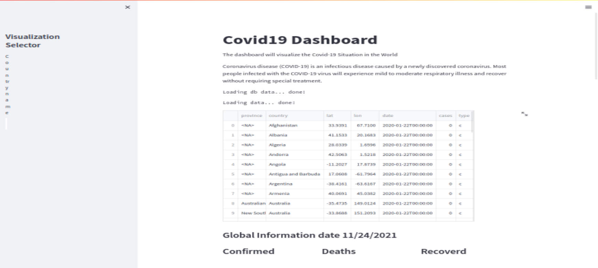
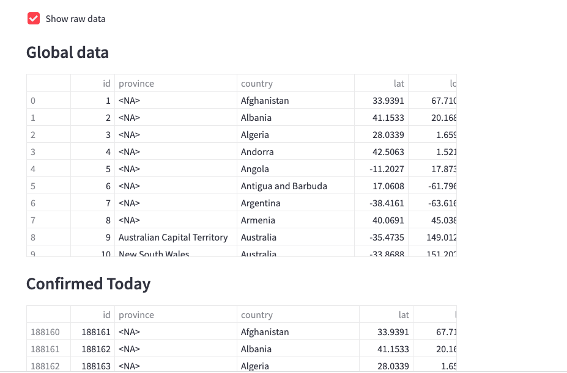
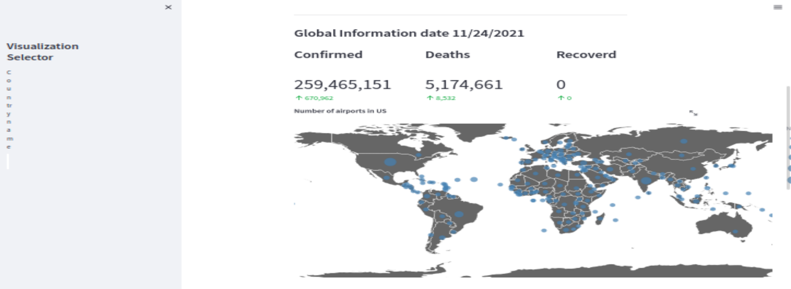
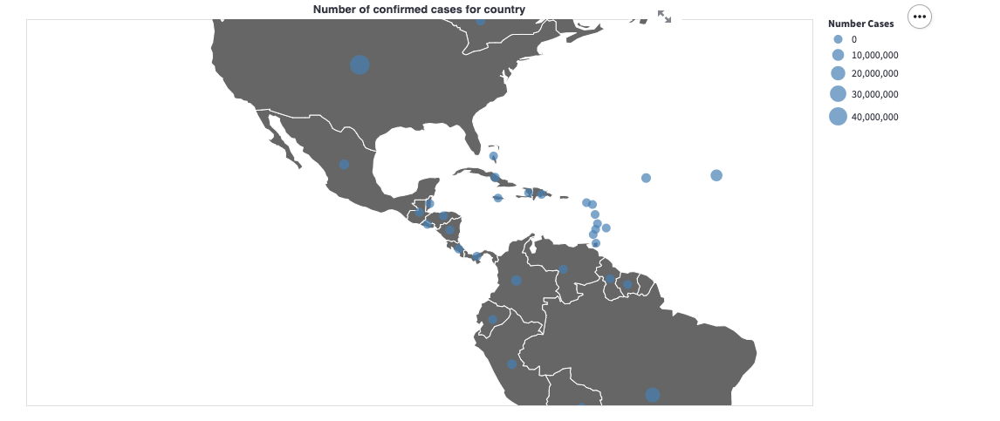

# Streamlit Covid19 Dashboard
Streamlit Project docs: https://streamlit.io/docs/

<p align="center">
  
</p>   
<p align="center">  
     
 </p>  
 <p align="center">   
     
  </p>    
 <p align="center">     
     
   
Get the project 
## Clone
```sh
git clone https://github.com/radouane69100/Projet-BI.git
```
*Page: https://github.com/radouane69100/Projet-BI

# Running Projet-BI (ETL -Postgres - Airflow - Streamlit-MySql) complete project

```sh
cd Streamlit-Covid
docker-compose build
docker-compose up
```
## What is getting done 
* Airflow workflow for etl proces.
* Postgresql for Airflow
* Mysql for datawarehouse 
* Streamlit app for dashboard visualization

## Containers:
* Container 1:   
  In this container hosts Streamlit to the visualization of the Dashboards. in this container it is getting done the following tasks:  
   •	Setting the title and the description of the dashboard  
   •	Connection to MySQL server  
   •	Reading the data of new cases, deaths and recoveries   
   •	Inserting the new data in MySQL   
   •	Creating the different parts of the dashboard:  
       o	The sidebar  
       o	The world maps  
       o	The graph  
       o	The bar graphs  
   •	Passing the data to the different part of the dashboard  
* Container 2:  
  This container hosts the MySQL server Database that contains the Data of COVID cases, deaths and recoveries.  
* Container 3:   
  This container hosts the Postgres server of Airflow.   
* Container 4:  
  This container hosts Airflow and it should charge automatically the Data from the CSV files and load the in the MySQL server. It is not working because the container   starts and stops. This bug should be fixed in order to load Data in MySQL server automat automatically.  

## Airflow Configurations
##### .config/airflow.cfg
Dags folder :
` dags_folder = /usr/local/airflow/dags`   

Paused dags
> Note: `hide_paused_dags_by_default = False` is set in this proyect.

##### Default Connections
This project requireds a set of default connections :
* File sensor for folder monitor.
* Mysql sensor for datawarehouse

This connections are created by default on startup, to change this set the file  

`files/conn.json`

## ETL dag's
on ./dags/
Exists 3 etl dags for ingest data 
* covid19_recovered_ingest_dag.py
* covid19_dead_ingest_dag.py
* covid19_recovered_ingest_dag.py

#### Etl Description 
<p align="center">
  
</p>
   
* Each dag performs the same process, it has a sensor file to load for Confirmed, dead, recovered respectively in the monitor folder.
* When the presence of a file is detected, it is loaded into a panda dataframe.
* Transformed to the desired structure 
* And finally entered into a mysql database.

**To enter airflow admin go to :** http://localhost:8080/admin/

#### Dags code 

* Get connections
    ```
    FILE_CONNECTION_NAME = 'monitor_file'
    CONNECTION_DB_NAME = 'mysql_db'
    ```
* Get file 
    ```
    file_path = FSHook(FILE_CONNECTION_NAME).get_path()
    filename = 'time_series_covid19_confirmed_global.csv'
    ```
* Mysql connection 
    ```
    mysql_connection = MySqlHook(mysql_conn_id=CONNECTION_DB_NAME).get_sqlalchemy_engine()
    ```
* Read file to a panda's Dataframe
    ```
    full_path = f'{file_path}/{filename}'
    df = (pd.read_csv(full_path, encoding = "ISO-8859-1")
          .rename(columns=COLUMNS)
    )
    ```
* Transform data 
    ``` 
   df = df.melt(id_vars=["province", "country","lat","lon"],
        var_name="date",
        value_name="cases")
    df['date'] = pd.to_datetime(df['date'],format='%m/%d/%y')
    df["type"] = 'c'
    ```
* Insert to mysql table, delete previous data 
    ``` 
   with mysql_connection.begin() as connection:
        connection.execute("DELETE FROM test.covid19_cases WHERE type='c'")
        df.to_sql('covid19_cases', con=connection, schema='test', if_exists='append', index=False)
    ```

## Running Streamlit Covid19 docker built-in Stand-alone examples 
### Docker-compose
```sh
cd Streamlit-covid
docker-compose up 
```
#### Go to 
Dashboard
` http://localhost:8501


#Projet-BI
